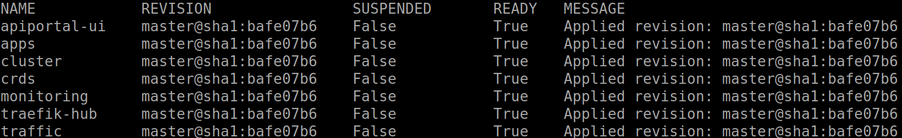
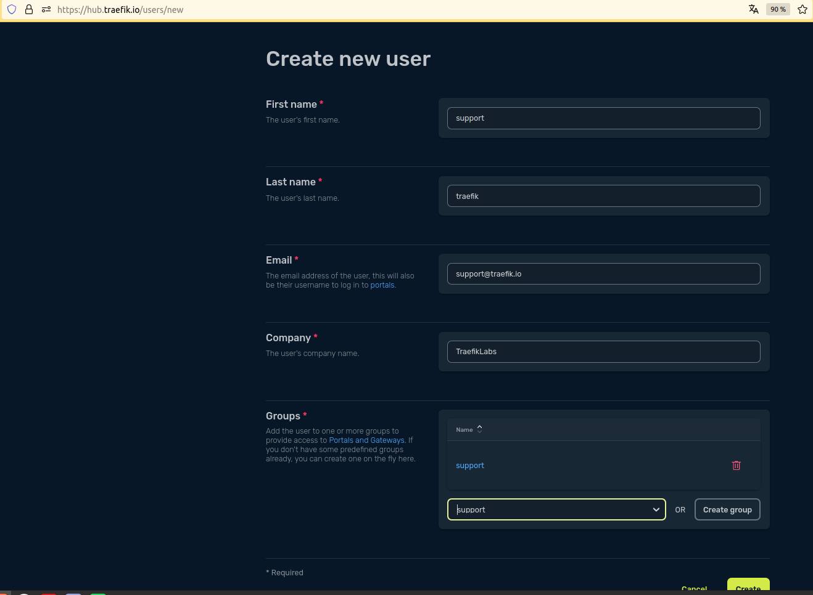
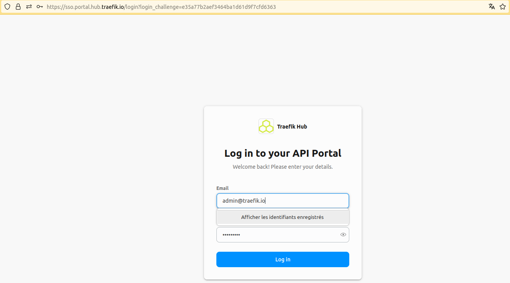
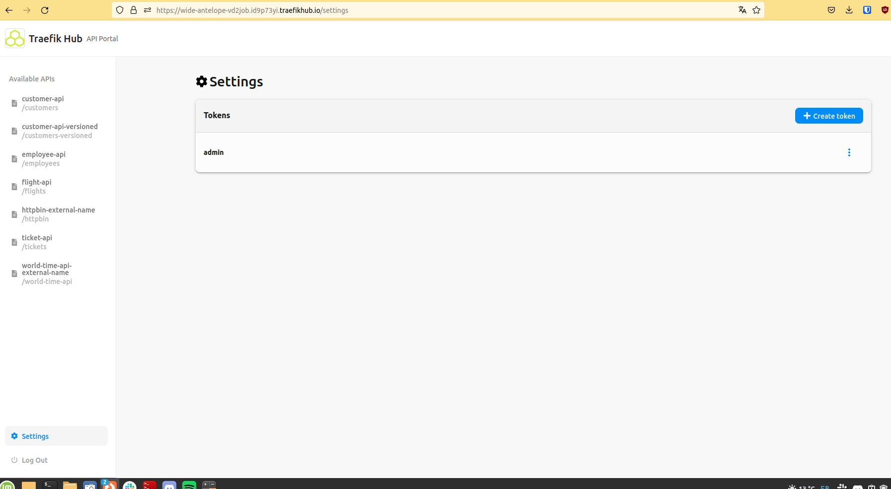
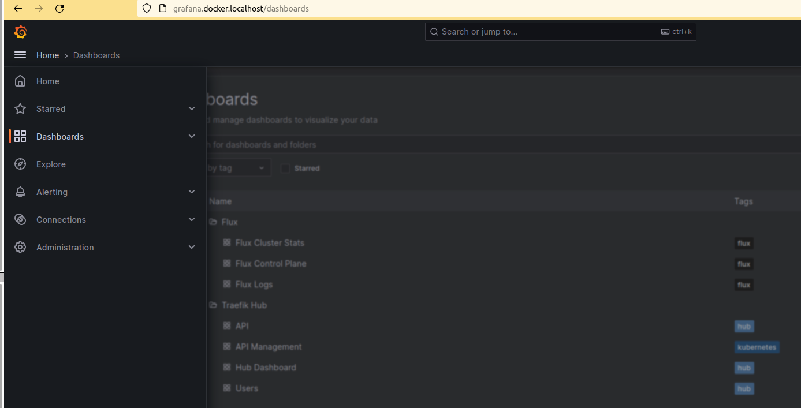

<br/>

<div align="center" style="margin: 30px;">
<a href="https://hub.traefik.io/">
  
</a>
<br />
<br />

<div align="center">
    <a href="https://hub.traefik.io">Log In</a> |
    <a href="https://doc.traefik.io/traefik-hub/">Documentation</a>
</div>
</div>

<br />

<div align="center"><strong>Traefik Hub - GitOps Complete Tutorial</strong>

<br />
<br />
</div>

<div align="center">Welcome to this tutorial!</div>

# About

This tutorial details how to deploy locally a Kubernetes cluster, with GitOps and observability components.

# Prerequisites

If you'd like to follow along with this tutorial on your own machine, you'll need a few things first:

1. [kubectl](https://github.com/kubernetes/kubectl) command-line tool installed and configured to access the cluster
2. [gh](https://cli.github.com/) command-line tool installed and configured with your account
3. [Flux CD](https://fluxcd.io/flux/cmd/) command-line tool installed.
4. A Kubernetes cluster running.

In this tutorial, you'll use [kind](https://kind.sigs.k8s.io). You may also use alternatives like [k3d](https://k3d.io/), cloud providers, or others.

kind requires some configuration to use an IngressController on localhost, see the following example:

```shell
cat kind.config
```

```yaml
kind: Cluster
apiVersion: kind.x-k8s.io/v1alpha4
name: traefik-hub-gitops
nodes:
- role: control-plane
  extraPortMappings:
  - containerPort: 30000
    hostPort: 80
    protocol: TCP
  - containerPort: 30001
    hostPort: 443
    protocol: TCP
```

1. Clone this GitHub repository:

```shell
git clone https://github.com/traefik-workshops/traefik-hub-gitops.git
cd traefik-hub-gitops
```

2. Create the Kubernetes cluster:

**Using kind**

Create the cluster:

```shell
kind create cluster --config=kind.config
kubectl cluster-info
kubectl wait --for=condition=ready nodes traefik-hub-gitops-control-plane
```

Add a load balancer (LB) to this Kubernetes cluster:

```shell
kubectl apply -f https://raw.githubusercontent.com/metallb/metallb/v0.13.11/config/manifests/metallb-native.yaml
kubectl wait --namespace metallb-system --for=condition=ready pod --selector=app=metallb --timeout=90s
kubectl apply -f clusters/kind/metallb-config.yaml
```

**Using k3d**

```shell
k3d cluster create traefik-hub-gitops --port 80:80@loadbalancer --port 443:443@loadbalancer --port 8000:8000@loadbalancer --k3s-arg "--disable=traefik@server:0"
```

# Fork the repo and deploy Flux CD

Flux needs to be able to commit on the repository, this tutorial can only work on a fork that *you* own.
You will also need a [GitHub personal access token](https://docs.github.com/en/authentication/keeping-your-account-and-data-secure/managing-your-personal-access-tokens) (PAT) with administration permissions.

```shell
gh repo fork --remote
kubectl apply -f clusters/kind/flux-system/gotk-components.yaml
```

# Configure Traefik Hub

Login to the [Traefik Hub UI](https://hub.traefik.io), open the page to [generate a new agent](https://hub.traefik.io/agents/new).
**Do not install the agent, but copy your token.**

Now, open a terminal and run these commands to create the secret needed for Traefik Hub.

```shell
export TRAEFIK_HUB_TOKEN=xxx
kubectl create namespace traefik-hub
kubectl create secret generic hub-agent-token --namespace traefik-hub --from-literal=token=${TRAEFIK_HUB_TOKEN}
```

# Deploy the stack on the cluster

Then, you can configure flux and launch it on the fork.
You'll need to create a [Personal Access Token](https://docs.github.com/en/authentication/keeping-your-account-and-data-secure/managing-your-personal-access-tokens#creating-a-personal-access-token-classic)(PAT) with repo access on your fork.

First, export your GitHub username and your newly created PAT into a variable.

```shell
export GITHUB_ACCOUNT=xxx
export GITHUB_TOKEN=yyy
```

Second, configure Flux CD for your fork of this tutorial.

```shell
flux create secret git git-auth  --url="https://github.com/${GITHUB_ACCOUNT}/traefik-hub-gitops" --namespace=flux-system -u git -p "${GITHUB_TOKEN}"
```

Third, adjust the repository on Flux to use your fork.

```shell
sed -i -e "s/traefik-workshops/${GITHUB_ACCOUNT}/g" clusters/kind/flux-system/gotk-sync.yaml
git commit -m "feat: GitOps on my fork" clusters/kind/flux-system/gotk-sync.yaml
git push origin
```

In the next step, deploy the repository.

```shell
kubectl apply -f clusters/kind/flux-system/gotk-sync.yaml
```

This will start the [Kustomization](https://fluxcd.io/flux/components/kustomize/kustomizations/).
Flux will now sync, validate and deploy all components.

This process will take several minutes.

You can track the process from the CLI.

```shell
flux get ks
```



# Configure traffic generation

To generate traffic, create two users, an `admin` and a `support` user and their groups.

The `admin` user needs to be part of the `admin` group and the `support` user needs to be part of the `support` group.

<details>
  <summary>Traefik Hub UI</summary>

Create the `admin` user in the Traefik Hub UI:


Create the `support` user:



</details>

When the Kustomization is **ready**, you can open API Portal, following URL available in the UI or in the CRD:

```shell
kubectl get apiportal
```

Log in to the API Portal:



Now, create API tokens for both users.



Create a [Kubernetes secret](https://kubernetes.io/docs/concepts/configuration/secret/) containing the tokens to enable the traffic app to generate load:

```shell
export ADMIN_TOKEN="xxx"
export SUPPORT_TOKEN="yyy"
kubectl create secret generic tokens -n traffic --from-literal=admin="${ADMIN_TOKEN}" --from-literal=support="${SUPPORT_TOKEN}"
```

# Use observability stack

Grafana is accessible on http://grafana.docker.localhost

Prometheus is on http://prometheus.docker.localhost

Default credentials are login: admin and password: admin.

By clicking on the left menu, you can access all dashboards:



## Enable event correlation

**Flux events**: Add a new Grafana service account with a new key at http://grafana.docker.localhost/org/serviceaccounts
and add the token (starting with `glsa_`) to the `apps/base/monitoring/flux-grafana.yaml` file. 

```shell
export GRAFANA_TOKEN="xxx"
sed -i -e "s/token:\(.*\)/token: \""${GRAFANA_TOKEN}"\"/g" apps/base/monitoring/flux-grafana.yaml
```

Now, Flux can create annotations of reconciliation events in the dashboards.

**GitHub PR merges**: Add a new Grafana connection (GitHub data source) at http://grafana.docker.localhost/connections/datasources/grafana-github-datasource
You must add a Personal Access Token (PAT) to GitHub at https://github.com/settings/tokens/new, as explained in the Grafana connection creation wizard.
When configured, edit the dashboards to add new annotations using the GitHub data source:
- Show in: All panels
- Query type: Pull Requests
- Owner / Repository: your user and the repo name of the fork
- Query: leave it empty
- Time Field: MergedAt
- Annotations:
  - Time field: `merged_at (time)`
  - Title: `title (string)`
  - Text: `url (string)`
  - End time + tags + id: leave them empty

# Clean up

Everything is installed in Kubernetes.
You can delete the Kubernetes cluster with the following command:

```shell
# kind
kind delete cluster --name traefik-hub-gitops
```

```shell
# k3d
k3d delete cluster traefik-hub-gitops
```

You may also want to delete the agent in Traefik Hub UI.

## License

The content in this repository is licensed under the [Apache 2 License](https://www.apache.org/licenses/LICENSE-2.0 "Link to Apache 2 license").
